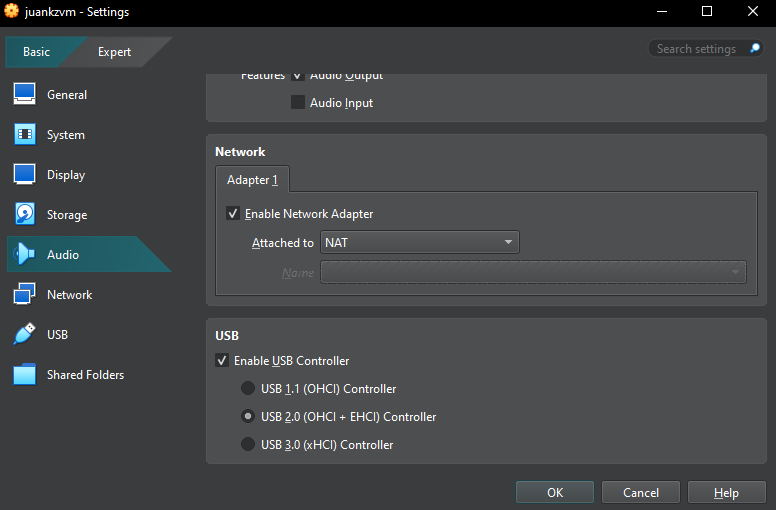
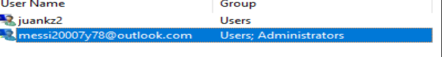
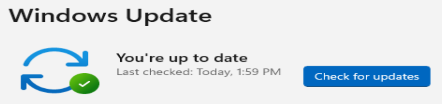
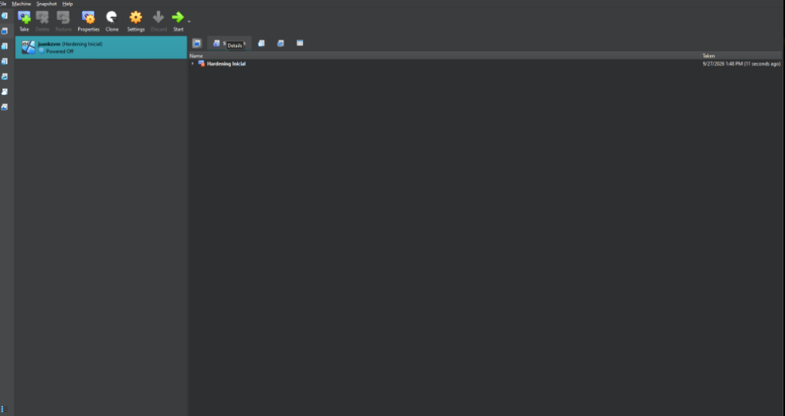

# mi primer laboratorio seguro de ciberseguridad

para este trabajo cree una maquina virtual con windows 11 en virtualbox. la idea es usarla para practicar sin hacer los cambios directamente en mi pc. configure la red, separe los usuarios, revise las actualizaciones y guarde un snapshot inicial.

## red de la maquina virtual

antes de usar la vm, deje el adaptador de red en modo nat. asi la maquina virtual puede conectarse a internet para actualizarse, pero no aparece en la red de mi casa como otro equipo, que es lo que pasaria si usara el modo puente. esto reduce la exposicion de la vm. igual, nat por si solo no significa que sea seguro ejecutar cualquier cosa dentro de ella.

## usuarios de windows

cree dos usuarios. `juankz2` es el usuario estandar que voy a usar para las practicas, y el otro tiene permisos de administrador. los separe para no trabajar todo el tiempo con permisos elevados. si necesito cambiar algo del sistema, uso la cuenta de administrador; para el uso normal, la estandar.

## windows update

entre a windows update y comprobe que apareciera el mensaje de que el sistema esta al dia. actualizarlo es importante porque muchas actualizaciones corrigen fallas de seguridad que ya se conocen.

## snapshot inicial

con la maquina apagada, cree un snapshot llamado `hardening inicial`. lo hice para tener un punto al que volver si durante alguna practica cambio una configuracion o rompo algo en la vm. en la captura se ve el snapshot en la lista de virtualbox.

## cierre

la vm quedo con red nat, un usuario estandar para practicar, windows update al dia y un snapshot inicial para restaurarla si hace falta.
